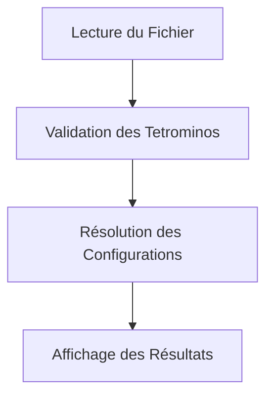

# Tetris Optimizer

## Description
Le projet `tetris-optimizer` est un outil développé en Go pour valider et optimiser les configurations de jeu Tetris.

## Architecture du Projet
Le projet est structuré de la manière suivante :
```
tetris-optimizer/
│
├── main.go                   # Point d'entrée du programme
├── go.mod                    # Fichier de configuration du module Go
├──README.md                   
├── pkg/
│   ├── cutline.go            # Gestion des lignes coupées
│   ├── Verify.go   # Validation des tetrominos
│   ├── Reader_file.go        # Lecture des fichiers d'entrée
│   └── tetromino_resolver.go # Résolution des configurations de tetrominos
└── veryhard.txt              # Exemple de fichier d'entrée
```

## Fonctionnement Général

1. **Lecture de Fichier** : Le programme lit le fichier d'entrée spécifié (`tetrominos.txt`).

2. **Validation** : Les tetrominos dans le fichier sont validés pour s'assurer qu'ils sont corrects.
3. **Résolution** : Le programme tente de résoudre la configuration en utilisant des algorithmes d'optimisation.
4. **Affichage des Résultats** : Les résultats sont affichés à l'utilisateur sous form de block de couleur.

## Schéma de Flux de Travail



## Utilisation
Pour exécuter le programme, utilisez les commandes suivantes :
```sh
go mod tidy
go run main.go
```
Assurez-vous que le fichier d'entrée (`tetrominos.txt`) est présent dans le répertoire racine du projet.

## Auteurs

DJIHADI RAFTANDJANI
